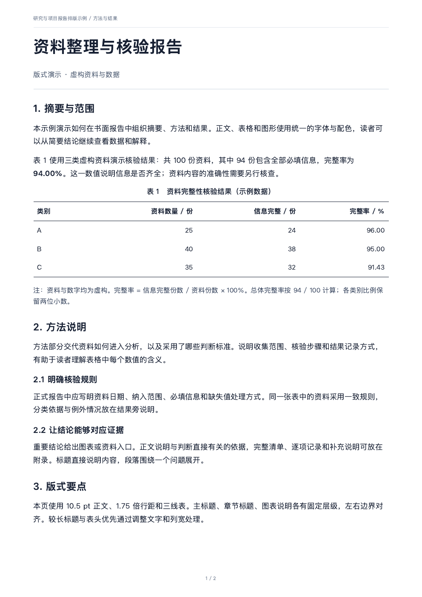
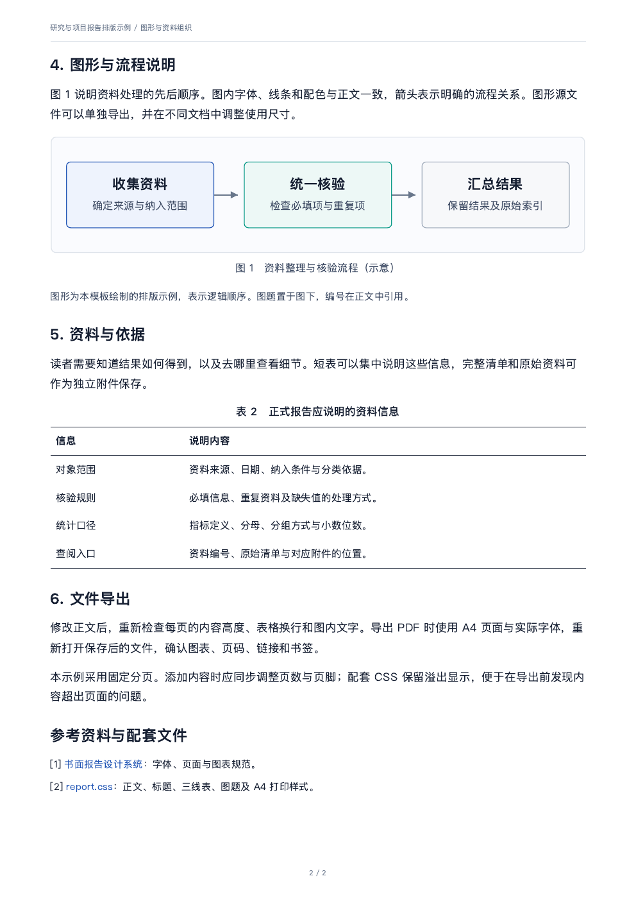

# Research Report Skill

面向研究报告、技术方案和项目总结的通用 Agent Skill。将资料组织、正式中文写作、图表规范和最终页面检查放在同一套工作流程中。

默认风格为 A4 单栏、苹方优先、深蓝灰正文和三线表。接收方的指定格式优先，主题、指标、章节和篇幅按真实材料调整。

## 使用

将 [skills/research-report](skills/research-report) 整个目录安装到支持 Agent Skills 的客户端，然后提供材料和要求：

```text
请使用 $research-report，根据这些资料编写一份项目研究报告。
读者是项目评审人员，交付 PDF 和可编辑源文件。
请保留来源，统一图表和引用，导出后逐页检查。
```

也可以只修改正文、审查报告或调整版式。技能会按任务读取相关参考文件，不强制重新制作所有材料。

### 在 Codex 中安装

可让内置安装器从本仓库安装：

```text
请使用 $skill-installer，从 https://github.com/AkkoYK/research-report-skill
安装 skills/research-report。
```

也可将该目录复制到项目的 `.agents/skills/research-report/`，或个人的 `~/.agents/skills/research-report/`。保留完整目录结构；已有同名技能时先比较内容，避免覆盖。安装入口与本地发现规则见 [OpenAI 官方文档](https://learn.chatgpt.com/docs/build-skills)。

其他兼容客户端按其官方说明放置同一技能目录。`agents/openai.yaml` 提供可选的产品界面信息，核心工作流程不绑定特定产品、模型或账号。

## 包含什么

| 内容 | 用途 |
|---|---|
| [SKILL.md](skills/research-report/SKILL.md) | 任务选择、主要约束与验收要求 |
| [写作与证据](skills/research-report/references/writing-and-evidence.md) | 内容结构、资料核验、数据表达和自然中文 |
| [设计系统](skills/research-report/references/design-system.md) | 字体、页面、三线表、图形及视觉检查 |
| [来源与范围](skills/research-report/references/sources-and-scope.md) | 公开依据、默认设计选择和格式规范 |
| [HTML 示例](skills/research-report/assets/html/example.html) | 两页可编辑样例，全部数字为虚构示例 |
| [渲染流程](skills/research-report/references/html-workflow.md) | 可选的本地预览、机械检查和 PDF 导出 |




示例用于展示排版，实际报告的结构和数据由真实材料决定。模板只提供字体名称与回退配置，不分发字体文件。

## 规范与验证

按 2026-09-05 核对的 [Agent Skills 开放规范](https://agentskills.io/specification)组织文件，使用必需的 `name`、`description` 和按需读取的参考资源；可选产品元数据位于 `agents/openai.yaml`。

仓库验证包含官方 `skills-ref` 格式检查、资源链接和界面元数据检查，以及渲染脚本测试。持续验证会测试示例导出、内容溢出、资源访问和已有文件保护。格式检查不代替正文核验与视觉验收。

本次发布的格式校验、13 项工具测试和两页 PDF 视觉检查已完成，详见[验证记录](docs/validation.md)。

本地验证：

```bash
python3 -m venv .venv
. .venv/bin/activate
python -m pip install -r requirements-dev.txt
python -m playwright install chromium
skills-ref validate skills/research-report
python tools/validate_skill.py
REPORT_RENDER_TESTS=1 python -m unittest discover -s tests -v
```

编写和审阅正文无需安装这些开发依赖。HTML 渲染单独依赖 Python 3.11+、Playwright 和 Chromium；配置方法见渲染流程。人工评估的跨任务场景保存在 [evals/scenarios.json](evals/scenarios.json)。

## 设计依据

内容组织参考 IEEE 的[报告写作指南](https://procomm.ieee.org/communication-resources-for-engineers/written-reports/write-effective-reports/)，图表清晰度参考其[图表指南](https://proceedingsoftheieee.ieee.org/resources/guidelines-for-figures-and-tables/)，三线表参考 [Overleaf 的 booktabs 示例](https://www.overleaf.com/learn/how-to/How_to_insert_tables_in_Overleaf)。正式中文写作吸收了 humanizer-zh 和 oil-tone 的通用表达原则。

具体字号、颜色和页边距是可调整的设计参数。该技能不预设某一学科或机构的投稿格式，强制要求应按实际接收方规定处理。

## 许可证

[MIT](LICENSE)。外部参考资料与字体保留各自权利和许可，未随本仓库分发。
